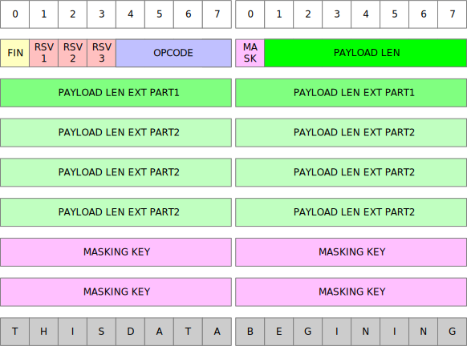

## Frame

frame is core concept in webscoket, also in other appliction protocol. it was defined as following:



as you see in up image, it can be divide into 4 parts: 
* header (16 bit)
* payload extern length (0/16/64 bits)
* masking key (0/32 bits)
* payload (ulimited)

### header notes
Among them, header contains the most information in 16 bit:
```sh
0   1   2   3   4   5   6   7   8 
|FIN|RSV1|RSV1|RSV1 | OPCODE    |

0   1   2   3   4   5   6   7   8 
|MASK|     PAYLOAD LEN          |
```

* FIN, means finnal
* RSV1, RSV2, RSV3 is resverd, MUST be 0, client and server both should valid these bits
* OPCODE, to mark DATA(text, binary) frame and control(ping, pong, close, contiuation) Frame
* MASK, if this bit is set, masking key CAN'T be empty, otherwise masking key CAN'T set
* PAYLOAD LEN, **IMPORTTAN** it's value could be: leq 125, eq 126, eq 127


more detail about payload len:

* leq 125, means actual_payload_length = uint7(payload extern length with 7 bits), payload extern length not SET
* eq 126, means actual_payload_length = uint16(payload extern length with 16 bits), payload extern length SET 16 bits
* eq 127, means actual_payload_length = uint64(payload extern length with 64 bits), payload extern length SET 64 bits

### Fragment

TODO:

### frame examples (data)

TODO:

1. normal

2. with mask been set

3. with extern payload length been set

### control frame notes

TODO:
