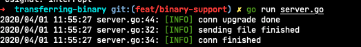

# transferring binary

Here is a demo for binary transferring: image from server side to client.

Server send `./example.png` to client, sending:


```go
// server.go
var (
	upgrader websocket.Upgrader
	r        io.Reader
	err      error
)

func init() {
	if r, err = os.Open("./example.png"); err != nil {
		panic(err)
	}
}

func download(w http.ResponseWriter, req *http.Request) {

	err = upgrader.Upgrade(w, req, func(conn *websocket.Conn) {
		defer log.Info("conn finished")
		if err := conn.SendBinary(r); err != nil {
			log.Errorf("write binary error: err=%v", err)
			return
		}
		log.Info("sending file finished")
		conn.Close()
	})

	if err != nil {
		log.Errorf("upgrade error, err=%v", err)
		// if _, ok := err.(websocket.HandshakeError); ok {
		// 	log.Errorf(err)
		// }
		return
	}

	log.Infof("conn upgrade done")
}

func main() {
	http.HandleFunc("/download", download)
	if err = http.ListenAndServe(":8080", nil); err != nil {
		log.Fatal(err)
	}
}
```


Client recving binary and save into `./example-dl.png`, recving: 


```go
// client.go
func main() {
	var (
		conn  *websocket.Conn
		err   error
		fd, _ = os.OpenFile("./example-dl.png", os.O_CREATE|os.O_RDWR, 0644)
	)
	conn, err = websocket.Dial("ws://localhost:8080/download")
	if err != nil {
		panic(err)
	}

	for {
		mt, payload, err := conn.ReadMessage()
		if err != nil {
			if ce, ok := err.(*websocket.CloseError); ok {
				fmt.Printf("close err=%d, %s\n", ce.Code, ce.Text)
				break
			}
			fmt.Printf("recv failed, err=%v\n", err)
		}

		fmt.Printf("messageType=%d\n", mt)
		if mt == websocket.BinaryMessage {
			fmt.Println("writing file into disk")
			if _, err := fd.Write(payload); err != nil {
				fmt.Printf("writing file failed, err=%v\n", err)
				continue
			}
			fmt.Println("writing file finished 23333")
		}
	}
}
```
